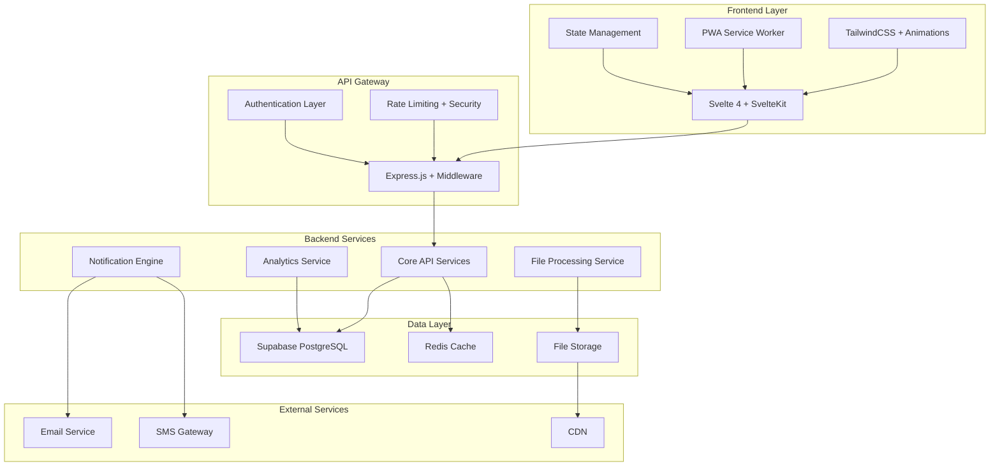

# Design Document

## Overview

This design document outlines the comprehensive enhancement of the Farid Cadet Academy application to create a world-class educational platform. The enhancements focus on three core pillars: **Visual Excellence**, **Performance Optimization**, and **Feature Expansion**. The design maintains backward compatibility while introducing modern technologies and best practices.

## Architecture

### High-Level Architecture



### Technology Stack Enhancements

#### Frontend Enhancements
- **SvelteKit Migration**: Upgrade from vanilla Svelte to SvelteKit for better SSR, routing, and performance
- **Animation Libraries**: Integrate Framer Motion for Svelte and GSAP for complex animations
- **UI Component Library**: Implement a custom design system with reusable components
- **PWA Features**: Add service workers, offline support, and push notifications
- **Performance**: Implement code splitting, lazy loading, and image optimization

#### Backend Enhancements
- **Microservices Architecture**: Modularize services for better scalability
- **Caching Layer**: Implement Redis for session management and data caching
- **File Processing**: Add image/video optimization and CDN integration
- **Real-time Features**: WebSocket integration for live notifications
- **Monitoring**: Application performance monitoring and logging

## Components and Interfaces

### Frontend Component Architecture

#### 1. Enhanced UI Components

**Design System Components:**
```typescript
// Component hierarchy
├── Layout/
│   ├── AppShell.svelte          // Main application wrapper
│   ├── Navbar.svelte            // Enhanced navigation with animations
│   ├── Sidebar.svelte           // Collapsible sidebar for admin
│   └── Footer.svelte            // Enhanced footer with links
├── UI/
│   ├── Button.svelte            // Multiple variants and states
│   ├── Card.svelte              // Flexible card component
│   ├── Modal.svelte             // Accessible modal system
│   ├── Toast.svelte             // Notification toasts
│   ├── Loading.svelte           // Loading states and skeletons
│   └── Form/
│       ├── Input.svelte         // Enhanced form inputs
│       ├── Select.svelte        // Custom select component
│       └── FileUpload.svelte    // Drag-and-drop file upload
├── Features/
│   ├── MediaGallery/
│   │   ├── Gallery.svelte       // Masonry layout gallery
│   │   ├── MediaViewer.svelte   // Lightbox media viewer
│   │   └── MediaUpload.svelte   // Bulk upload interface
│   ├── Dashboard/
│   │   ├── Analytics.svelte     // Charts and metrics
│   │   ├── QuickActions.svelte  // Action shortcuts
│   │   └── RecentActivity.svelte // Activity feed
│   └── Notifications/
│       ├── NotificationCenter.svelte
│       └── NotificationItem.svelte
```

#### 2. Animation System

**Animation Framework:**
- **Page Transitions**: Smooth route transitions with loading states
- **Micro-interactions**: Hover effects, button animations, form feedback
- **Scroll Animations**: Intersection Observer-based animations
- **Loading States**: Skeleton screens and progressive loading
- **Gesture Support**: Touch gestures for mobile interactions

#### 3. Responsive Design System

**Breakpoint Strategy:**
```css
/* Mobile-first responsive design */
sm: 640px   /* Small devices */
md: 768px   /* Medium devices */
lg: 1024px  /* Large devices */
xl: 1280px  /* Extra large devices */
2xl: 1536px /* Ultra wide screens */
```

### Backend Service Architecture

#### 1. Enhanced API Structure

**Service Layer Organization:**
```javascript
├── services/
│   ├── auth/
│   │   ├── AuthService.js       // Authentication logic
│   │   ├── PermissionService.js // Role-based permissions
│   │   └── SessionService.js    // Session management
│   ├── content/
│   │   ├── NoticeService.js     // Notice management
│   │   ├── MediaService.js      // Media processing
│   │   └── ContentService.js    // General content
│   ├── user/
│   │   ├── UserService.js       // User management
│   │   ├── ProfileService.js    // Profile operations
│   │   └── PreferenceService.js // User preferences
│   ├── analytics/
│   │   ├── AnalyticsService.js  // Data collection
│   │   ├── ReportService.js     // Report generation
│   │   └── MetricsService.js    // Performance metrics
│   └── notification/
│       ├── EmailService.js      // Email notifications
│       ├── SMSService.js        // SMS notifications
│       └── PushService.js       // Push notifications
```

#### 2. Enhanced Middleware Stack

**Security and Performance Middleware:**
```javascript
// Enhanced middleware pipeline
├── security/
│   ├── rateLimiting.js          // Advanced rate limiting
│   ├── inputValidation.js       // Comprehensive validation
│   ├── sanitization.js          // Data sanitization
│   └── csrfProtection.js        // CSRF protection
├── performance/
│   ├── compression.js           // Response compression
│   ├── caching.js               // HTTP caching headers
│   └── monitoring.js            // Performance monitoring
├── logging/
│   ├── requestLogger.js         // Request/response logging
│   ├── errorLogger.js           // Error tracking
│   └── auditLogger.js           // Security audit logs
```

## Data Models

### Enhanced Database Schema

#### 1. User Management Enhancement

```sql
-- Enhanced users table
CREATE TABLE users (
    id UUID PRIMARY KEY DEFAULT gen_random_uuid(),
    email VARCHAR(255) UNIQUE NOT NULL,
    password_hash VARCHAR(255) NOT NULL,
    role user_role NOT NULL DEFAULT 'student',
    profile JSONB DEFAULT '{}',
    preferences JSONB DEFAULT '{}',
    last_login TIMESTAMP WITH TIME ZONE,
    email_verified BOOLEAN DEFAULT FALSE,
    two_factor_enabled BOOLEAN DEFAULT FALSE,
    created_at TIMESTAMP WITH TIME ZONE DEFAULT NOW(),
    updated_at TIMESTAMP WITH TIME ZONE DEFAULT NOW()
);

-- User profiles with extended information
CREATE TABLE user_profiles (
    user_id UUID PRIMARY KEY REFERENCES users(id) ON DELETE CASCADE,
    first_name VARCHAR(100),
    last_name VARCHAR(100),
    phone VARCHAR(20),
    address TEXT,
    date_of_birth DATE,
    guardian_info JSONB,
    academic_info JSONB,
    profile_image_url TEXT,
    created_at TIMESTAMP WITH TIME ZONE DEFAULT NOW(),
    updated_at TIMESTAMP WITH TIME ZONE DEFAULT NOW()
);
```

#### 2. Content Management Enhancement

```sql
-- Enhanced notices with rich content
CREATE TABLE notices (
    id UUID PRIMARY KEY DEFAULT gen_random_uuid(),
    title VARCHAR(255) NOT NULL,
    content TEXT NOT NULL,
    content_type VARCHAR(50) DEFAULT 'text',
    rich_content JSONB,
    author_id UUID REFERENCES users(id),
    category VARCHAR(100),
    priority notice_priority DEFAULT 'normal',
    target_audience JSONB DEFAULT '[]',
    scheduled_at TIMESTAMP WITH TIME ZONE,
    expires_at TIMESTAMP WITH TIME ZONE,
    is_published BOOLEAN DEFAULT FALSE,
    view_count INTEGER DEFAULT 0,
    created_at TIMESTAMP WITH TIME ZONE DEFAULT NOW(),
    updated_at TIMESTAMP WITH TIME ZONE DEFAULT NOW()
);

-- Media with enhanced metadata
CREATE TABLE media_items (
    id UUID PRIMARY KEY DEFAULT gen_random_uuid(),
    title VARCHAR(255) NOT NULL,
    description TEXT,
    file_url TEXT NOT NULL,
    file_type VARCHAR(50) NOT NULL,
    file_size BIGINT,
    metadata JSONB DEFAULT '{}',
    thumbnail_url TEXT,
    category VARCHAR(100),
    tags TEXT[],
    uploaded_by UUID REFERENCES users(id),
    is_public BOOLEAN DEFAULT TRUE,
    view_count INTEGER DEFAULT 0,
    download_count INTEGER DEFAULT 0,
    created_at TIMESTAMP WITH TIME ZONE DEFAULT NOW(),
    updated_at TIMESTAMP WITH TIME ZONE DEFAULT NOW()
);
```

#### 3. Analytics and Tracking

```sql
-- User activity tracking
CREATE TABLE user_activities (
    id UUID PRIMARY KEY DEFAULT gen_random_uuid(),
    user_id UUID REFERENCES users(id),
    action VARCHAR(100) NOT NULL,
    resource_type VARCHAR(50),
    resource_id UUID,
    metadata JSONB DEFAULT '{}',
    ip_address INET,
    user_agent TEXT,
    created_at TIMESTAMP WITH TIME ZONE DEFAULT NOW()
);

-- System metrics
CREATE TABLE system_metrics (
    id UUID PRIMARY KEY DEFAULT gen_random_uuid(),
    metric_name VARCHAR(100) NOT NULL,
    metric_value NUMERIC,
    metadata JSONB DEFAULT '{}',
    recorded_at TIMESTAMP WITH TIME ZONE DEFAULT NOW()
);
```

### Caching Strategy

#### Redis Cache Structure

```javascript
// Cache key patterns
const CACHE_KEYS = {
    USER_SESSION: 'session:user:{userId}',
    USER_PROFILE: 'profile:user:{userId}',
    NOTICES_LIST: 'notices:list:{page}:{limit}',
    MEDIA_GALLERY: 'media:gallery:{category}:{page}',
    ANALYTICS_DATA: 'analytics:{type}:{period}',
    SYSTEM_CONFIG: 'config:system',
    POPULAR_CONTENT: 'content:popular:{type}'
};

// Cache TTL settings
const CACHE_TTL = {
    SESSION: 24 * 60 * 60,      // 24 hours
    PROFILE: 60 * 60,           // 1 hour
    CONTENT: 30 * 60,           // 30 minutes
    ANALYTICS: 15 * 60,         // 15 minutes
    CONFIG: 60 * 60             // 1 hour
};
```

## Error Handling

### Comprehensive Error Management

#### 1. Frontend Error Handling

```javascript
// Error boundary system
class ErrorBoundary {
    constructor() {
        this.errors = writable([]);
        this.setupGlobalHandlers();
    }
    
    setupGlobalHandlers() {
        // Unhandled promise rejections
        window.addEventListener('unhandledrejection', this.handleError);
        
        // JavaScript errors
        window.addEventListener('error', this.handleError);
        
        // Network errors
        this.setupNetworkErrorHandling();
    }
    
    handleError(error) {
        // Log error
        console.error('Application Error:', error);
        
        // Send to monitoring service
        this.reportError(error);
        
        // Show user-friendly message
        this.showErrorToast(error);
    }
}
```

#### 2. Backend Error Handling

```javascript
// Enhanced error middleware
const errorHandler = (err, req, res, next) => {
    // Log error with context
    logger.error('API Error', {
        error: err.message,
        stack: err.stack,
        url: req.url,
        method: req.method,
        userId: req.user?.id,
        timestamp: new Date().toISOString()
    });
    
    // Determine error type and response
    const errorResponse = {
        error: true,
        message: getErrorMessage(err),
        code: getErrorCode(err),
        timestamp: new Date().toISOString()
    };
    
    // Add debug info in development
    if (process.env.NODE_ENV === 'development') {
        errorResponse.stack = err.stack;
        errorResponse.details = err.details;
    }
    
    res.status(getStatusCode(err)).json(errorResponse);
};
```

### Error Recovery Strategies

#### 1. Graceful Degradation

- **Offline Mode**: Cache critical data for offline access
- **Fallback UI**: Show simplified interfaces when services are unavailable
- **Retry Logic**: Automatic retry for transient failures
- **Progressive Enhancement**: Core functionality works without JavaScript

#### 2. User Experience During Errors

- **Loading States**: Clear loading indicators during operations
- **Error Messages**: User-friendly error messages with actionable steps
- **Recovery Options**: Provide ways for users to recover from errors
- **Support Integration**: Easy access to help and support

## Testing Strategy

### Comprehensive Testing Approach

#### 1. Frontend Testing

```javascript
// Testing pyramid structure
├── Unit Tests (70%)
│   ├── Component testing with Vitest
│   ├── Store/state management testing
│   ├── Utility function testing
│   └── API client testing
├── Integration Tests (20%)
│   ├── Component integration testing
│   ├── API integration testing
│   ├── Authentication flow testing
│   └── File upload testing
└── E2E Tests (10%)
    ├── Critical user journeys
    ├── Cross-browser testing
    ├── Mobile responsiveness testing
    └── Performance testing
```

#### 2. Backend Testing

```javascript
// Backend testing structure
├── Unit Tests
│   ├── Service layer testing
│   ├── Middleware testing
│   ├── Utility function testing
│   └── Database model testing
├── Integration Tests
│   ├── API endpoint testing
│   ├── Database integration testing
│   ├── External service integration
│   └── Authentication testing
├── Performance Tests
│   ├── Load testing with Artillery
│   ├── Database query optimization
│   ├── Memory usage testing
│   └── Concurrent user testing
└── Security Tests
    ├── Input validation testing
    ├── Authentication bypass testing
    ├── SQL injection testing
    └── XSS vulnerability testing
```

### Testing Tools and Frameworks

- **Frontend**: Vitest, Testing Library, Playwright
- **Backend**: Jest, Supertest, Artillery
- **E2E**: Playwright, Cypress
- **Performance**: Lighthouse, WebPageTest
- **Security**: OWASP ZAP, Snyk

## Performance Optimization

### Frontend Performance

#### 1. Code Optimization

- **Bundle Splitting**: Route-based code splitting
- **Tree Shaking**: Remove unused code
- **Image Optimization**: WebP format, lazy loading, responsive images
- **Font Optimization**: Font display swap, preload critical fonts
- **CSS Optimization**: Critical CSS inlining, unused CSS removal

#### 2. Runtime Performance

- **Virtual Scrolling**: For large lists and galleries
- **Memoization**: Cache expensive computations
- **Debouncing**: Optimize search and input handling
- **Intersection Observer**: Efficient scroll-based animations
- **Service Worker**: Intelligent caching strategies

### Backend Performance

#### 1. Database Optimization

```sql
-- Optimized indexes
CREATE INDEX CONCURRENTLY idx_notices_published_created 
ON notices (is_published, created_at DESC) 
WHERE is_published = true;

CREATE INDEX CONCURRENTLY idx_media_category_created 
ON media_items (category, created_at DESC) 
WHERE is_public = true;

CREATE INDEX CONCURRENTLY idx_user_activities_user_created 
ON user_activities (user_id, created_at DESC);
```

#### 2. Caching Strategy

- **Redis Caching**: Session data, frequently accessed content
- **HTTP Caching**: Proper cache headers for static assets
- **Database Query Caching**: Cache expensive queries
- **CDN Integration**: Global content delivery

### Monitoring and Analytics

#### 1. Performance Monitoring

```javascript
// Performance monitoring setup
const performanceMonitor = {
    // Track Core Web Vitals
    trackWebVitals() {
        // Largest Contentful Paint (LCP)
        // First Input Delay (FID)
        // Cumulative Layout Shift (CLS)
    },
    
    // Track custom metrics
    trackCustomMetrics() {
        // Page load times
        // API response times
        // User interaction metrics
    },
    
    // Real User Monitoring (RUM)
    setupRUM() {
        // Track real user experiences
        // Performance across different devices
        // Geographic performance variations
    }
};
```

#### 2. Business Analytics

- **User Engagement**: Track user interactions and content consumption
- **Content Performance**: Monitor notice views, media downloads
- **System Health**: Track error rates, response times, uptime
- **User Journey**: Analyze user flows and conversion funnels

This design provides a comprehensive roadmap for transforming the Farid Cadet Academy into a world-class educational platform with enhanced beauty, performance, and functionality while maintaining the existing architecture's strengths.