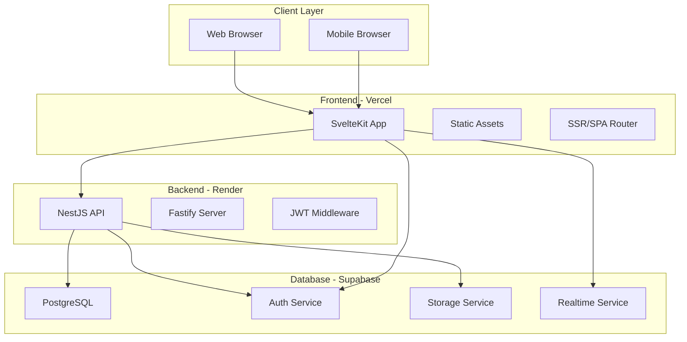

# Design Document

## Overview

The FCA web application is designed as a modern, multilingual, and responsive platform for Farid Cadet Academy. The system follows a three-tier architecture with a SvelteKit frontend, NestJS backend, and Supabase database, ensuring scalability, security, and maintainability.

## Architecture

### High-Level Architecture



### Technology Stack

- **Frontend**: SvelteKit + TailwindCSS + ShadCN-Svelte + Lucide Icons + Motion One
- **Backend**: Node.js + NestJS + Fastify
- **Database**: Supabase (PostgreSQL + Auth + Storage + Realtime)
- **Deployment**: Vercel (Frontend) + Render (Backend)
- **Language**: TypeScript throughout

## Components and Interfaces

### Frontend Components

#### Core Layout Components
- **AppShell**: Main application wrapper with navigation and theme management
- **Navigation**: Responsive navigation bar with language and theme toggles
- **Footer**: Academy contact information and links
- **LanguageToggle**: Component for switching between Bangla and English
- **ThemeToggle**: Component for light/dark/system theme selection

#### Page Components
- **HomePage**: Hero section with academy introduction and key information
- **TeachersPage**: Grid layout displaying verified teacher profiles
- **FacilitiesPage**: Showcase of academy facilities and services
- **NoticesPage**: List of announcements and important notices
- **MediaPage**: Gallery for images and videos
- **ContactPage**: Contact form and academy information
- **AuthPages**: Login and registration forms

#### UI Components (ShadCN-Svelte)
- **Button**: Consistent button styling across the application
- **Input**: Form input fields with validation states
- **Card**: Content containers for teachers, notices, and media
- **Dialog**: Modal dialogs for forms and confirmations
- **Toast**: Notification system for user feedback

### Backend Modules

#### Authentication Module
- **AuthController**: Handles login, registration, and token validation
- **AuthService**: Business logic for user authentication
- **JwtStrategy**: JWT token validation middleware
- **RoleGuard**: Role-based access control

#### User Management Module
- **UsersController**: User profile management endpoints
- **UsersService**: User business logic and database operations
- **ProfileDto**: Data transfer objects for user profiles

#### Teachers Module
- **TeachersController**: Teacher-specific endpoints
- **TeachersService**: Teacher verification and management
- **TeacherApplicationDto**: Data structure for teacher applications

#### Content Module
- **NoticesController**: Notice management endpoints
- **MediaController**: Media upload and retrieval
- **ContentService**: Content management business logic

### API Interface Design

#### Authentication Endpoints
```typescript
POST /auth/register
Body: {
  firstName: string;
  lastName: string;
  email: string;
  password: string;
  confirmPassword: string;
  phone?: string;
  role: 'student' | 'guardian' | 'teacher';
  teacherCode?: string;
}

POST /auth/login
Body: {
  email: string;
  password: string;
}

GET /auth/profile
Headers: { Authorization: 'Bearer <token>' }
```

#### Teachers Endpoints
```typescript
POST /teachers/apply
Headers: { Authorization: 'Bearer <token>' }
Body: {
  bio: string;
  subjects: string[];
}

GET /teachers
Response: Teacher[]

PUT /teachers/:id/verify
Headers: { Authorization: 'Bearer <admin-token>' }
```

#### Content Endpoints
```typescript
GET /notices?language=en|bn
Response: Notice[]

GET /media
Response: MediaItem[]

POST /media/upload
Headers: { Authorization: 'Bearer <token>' }
Body: FormData
```

## Data Models

### Database Schema

#### Profiles Table
```sql
CREATE TABLE profiles (
  id uuid PRIMARY KEY DEFAULT gen_random_uuid(),
  supabase_user_id uuid UNIQUE REFERENCES auth.users(id),
  first_name text NOT NULL,
  last_name text NOT NULL,
  email text UNIQUE NOT NULL,
  phone text,
  role text DEFAULT 'student' CHECK (role IN ('student', 'guardian', 'teacher', 'admin')),
  is_approved boolean DEFAULT false,
  created_at timestamptz DEFAULT now(),
  updated_at timestamptz DEFAULT now()
);
```

#### Teachers Table
```sql
CREATE TABLE teachers (
  id uuid PRIMARY KEY DEFAULT gen_random_uuid(),
  profile_id uuid REFERENCES profiles(id) ON DELETE CASCADE,
  verified boolean DEFAULT false,
  bio text,
  subjects text[],
  verification_date timestamptz,
  created_at timestamptz DEFAULT now(),
  updated_at timestamptz DEFAULT now()
);
```

#### Notices Table
```sql
CREATE TABLE notices (
  id uuid PRIMARY KEY DEFAULT gen_random_uuid(),
  title text NOT NULL,
  body text NOT NULL,
  language text DEFAULT 'bn' CHECK (language IN ('bn', 'en')),
  is_published boolean DEFAULT false,
  author_id uuid REFERENCES profiles(id),
  created_at timestamptz DEFAULT now(),
  updated_at timestamptz DEFAULT now()
);
```

#### Media Table
```sql
CREATE TABLE media (
  id uuid PRIMARY KEY DEFAULT gen_random_uuid(),
  title text NOT NULL,
  description text,
  file_path text NOT NULL,
  file_type text NOT NULL,
  file_size bigint,
  uploaded_by uuid REFERENCES profiles(id),
  is_public boolean DEFAULT true,
  created_at timestamptz DEFAULT now()
);
```

### Row Level Security Policies

```sql
-- Profiles: Users can read their own profile, admins can read all
ALTER TABLE profiles ENABLE ROW LEVEL SECURITY;

CREATE POLICY "Users can view own profile" ON profiles
  FOR SELECT USING (supabase_user_id = auth.uid());

CREATE POLICY "Admins can view all profiles" ON profiles
  FOR SELECT USING (
    EXISTS (
      SELECT 1 FROM profiles 
      WHERE supabase_user_id = auth.uid() 
      AND role = 'admin'
    )
  );

-- Teachers: Public read for verified teachers
CREATE POLICY "Public can view verified teachers" ON teachers
  FOR SELECT USING (verified = true);

-- Notices: Public read for published notices
CREATE POLICY "Public can view published notices" ON notices
  FOR SELECT USING (is_published = true);

-- Media: Public read for public media
CREATE POLICY "Public can view public media" ON media
  FOR SELECT USING (is_public = true);
```

## Internationalization Design

### Language Management
- **svelte-i18n**: Primary internationalization library
- **Language Store**: Svelte store for current language state
- **Translation Files**: JSON files for Bangla and English translations
- **Fallback System**: English as fallback for missing translations

### Translation Structure
```typescript
// translations/en.json
{
  "navigation": {
    "home": "Home",
    "teachers": "Teachers",
    "facilities": "Facilities",
    "notices": "Notices",
    "media": "Media",
    "contact": "Contact"
  },
  "auth": {
    "login": "Login",
    "register": "Register",
    "email": "Email",
    "password": "Password"
  }
}

// translations/bn.json
{
  "navigation": {
    "home": "হোম",
    "teachers": "শিক্ষকবৃন্দ",
    "facilities": "সুবিধাসমূহ",
    "notices": "নোটিশ",
    "media": "মিডিয়া",
    "contact": "যোগাযোগ"
  }
}
```

## Theme System Design

### Theme Management
- **Theme Store**: Svelte store for theme state
- **CSS Variables**: Dynamic theme switching using CSS custom properties
- **Local Storage**: Persistence of theme preferences
- **System Detection**: Automatic system theme detection

### Theme Implementation
```typescript
// stores/theme.ts
export const theme = writable<'light' | 'dark' | 'system'>('system');

// CSS Variables approach
:root {
  --color-primary: 59 130 246; /* blue-500 */
  --color-background: 255 255 255; /* white */
  --color-foreground: 15 23 42; /* slate-900 */
}

.dark {
  --color-background: 15 23 42; /* slate-900 */
  --color-foreground: 248 250 252; /* slate-50 */
}
```

## Security Design

### Authentication Flow
1. User submits credentials to frontend
2. Frontend sends request to NestJS backend
3. Backend validates credentials with Supabase Auth
4. Supabase returns JWT token
5. Backend validates token and returns user session
6. Frontend stores token and establishes authenticated state

### Authorization Levels
- **Public**: Access to home, teachers, facilities, notices, media, contact pages
- **Authenticated**: Access to profile management and personalized content
- **Teacher**: Access to teacher-specific features after verification
- **Admin**: Full system access including user management and content moderation

### Security Measures
- **JWT Validation**: All protected endpoints validate JWT tokens
- **Role-based Access**: Different access levels based on user roles
- **Input Validation**: Comprehensive validation using class-validator
- **Rate Limiting**: API rate limiting to prevent abuse
- **CORS Configuration**: Proper CORS setup for cross-origin requests
- **Environment Variables**: Sensitive data stored in environment variables

## Error Handling

### Frontend Error Handling
- **Global Error Boundary**: Catch and display unexpected errors
- **Form Validation**: Real-time validation with user-friendly messages
- **API Error Handling**: Consistent error message display
- **Toast Notifications**: User feedback for success and error states

### Backend Error Handling
- **Global Exception Filter**: Centralized error handling
- **Validation Pipes**: Input validation with detailed error messages
- **HTTP Status Codes**: Appropriate status codes for different error types
- **Error Logging**: Comprehensive error logging for debugging

### Error Response Format
```typescript
interface ErrorResponse {
  statusCode: number;
  message: string | string[];
  error: string;
  timestamp: string;
  path: string;
}
```

## Testing Strategy

### Frontend Testing
- **Unit Tests**: Component testing using Vitest and Testing Library
- **Integration Tests**: Page-level testing with user interactions
- **E2E Tests**: Critical user flows using Playwright
- **Visual Regression**: Screenshot testing for UI consistency

### Backend Testing
- **Unit Tests**: Service and controller testing with Jest
- **Integration Tests**: API endpoint testing with test database
- **Authentication Tests**: JWT and role-based access testing
- **Database Tests**: Repository pattern testing with test fixtures

### Test Coverage Goals
- **Unit Tests**: 80% code coverage minimum
- **Integration Tests**: All API endpoints covered
- **E2E Tests**: Critical user journeys covered
- **Performance Tests**: Load testing for key endpoints

## Performance Optimization

### Frontend Optimization
- **Server-Side Rendering**: Initial page load optimization
- **Code Splitting**: Dynamic imports for route-based splitting
- **Image Optimization**: Responsive images with proper formats
- **Caching Strategy**: Browser caching for static assets
- **Bundle Analysis**: Regular bundle size monitoring

### Backend Optimization
- **Database Indexing**: Proper indexes on frequently queried columns
- **Connection Pooling**: Efficient database connection management
- **Caching Layer**: Redis caching for frequently accessed data
- **API Response Optimization**: Pagination and field selection
- **Monitoring**: Performance monitoring and alerting

## Deployment Architecture

### Frontend Deployment (Vercel)
- **Build Process**: SvelteKit static site generation
- **CDN Distribution**: Global content delivery network
- **Environment Variables**: Secure configuration management
- **Preview Deployments**: Branch-based preview environments

### Backend Deployment (Render)
- **Container Deployment**: Docker-based deployment
- **Auto-scaling**: Automatic scaling based on load
- **Health Checks**: Application health monitoring
- **Environment Management**: Secure environment variable handling

### Database (Supabase)
- **Managed PostgreSQL**: Fully managed database service
- **Automatic Backups**: Regular database backups
- **Connection Pooling**: Built-in connection management
- **Real-time Features**: WebSocket connections for live updates